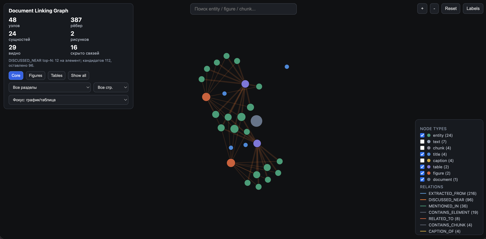
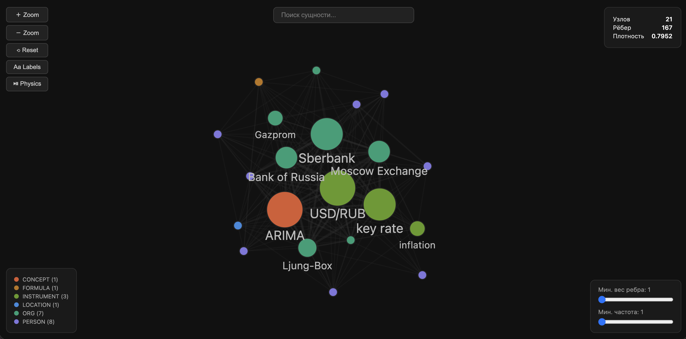

# Results

This document records a reproducible example run and explains the generated artifacts.

If input documents, the MinerU backend, NER engine, model versions, or graph thresholds change, regenerate the metrics.

---

## Example Run Configuration

```bash
python scripts/create_demo_input.py
bash scripts/run_pipeline.sh data/raw_demo pipeline 512 1 12
```

Configuration:

```text
MinerU backend: pipeline
Chunk max tokens: 512
NER engine: SpaCy + optional GLiNER enrichment
Minimum edge weight: 1
Max entity links per structured element: 12
Documents: 1
```

---

## Generated Outputs

```text
outputs/
├── entity_graph_clean.html
├── entity_graph_clean.graphml
├── entity_graph_clean.json
├── resolved_entities_clean.json
├── graph_metrics_clean.json
├── document_links.html
├── document_links.graphml
├── document_links.json
└── linking_metrics.json
```

### Interactive HTML

- `entity_graph_clean.html` — cleaned entity co-occurrence graph.
- `document_links.html` — provenance-aware document linking graph.

### JSON

- `entity_graph_clean.json` — entity graph nodes, edges, and metrics.
- `document_links.json` — linking graph nodes, edges, and metrics.
- `resolved_entities_clean.json` — cleaned/resolved entity records.
- `graph_metrics_clean.json` — entity graph metrics.
- `linking_metrics.json` — linking graph metrics.

### GraphML

- `entity_graph_clean.graphml`
- `document_links.graphml`

GraphML preserves graph nodes, edges, and sanitized attributes in a format suitable for Gephi and other graph-analysis tooling.

---

## Entity Graph Metrics

Source:

```text
outputs/graph_metrics_clean.json
```

Example demo values:

```text
Nodes: 21
Edges: 167
Density: 0.7952
Average degree: 15.9
Connected components: 1
Largest component: 21
Communities: 3
```

The entity graph is a weighted co-occurrence graph. Two entity nodes are connected when they appear in the same chunk.

This is a reproducible baseline and should **not** be interpreted as semantic relation extraction.

Additional metrics may include:

```text
max_degree_node
max_degree
top_pagerank
community_sizes
```

---

## Document Linking Graph Metrics

Source:

```text
outputs/linking_metrics.json
```

Example demo values:

```text
Documents: 1
Entities: 24
Chunks: 4
Figures: 2
Captions: 4
Tables: 2
Nodes: 48
Edges: 387

Figure-caption links: 4
Entity-figure links: 24
Entity-table links: 24
Chunk-related links: 8

DISCUSSED_NEAR candidates: 112
DISCUSSED_NEAR kept: 96
DISCUSSED_NEAR pruned: 16
Max entity links per structured element: 12
```

The linking graph is structural. Its relationships are derived from MinerU layout elements and provenance propagated through chunks and entities.

---

## Example Visualizations

Place the screenshots in:

```text
docs/images/
├── document-linking-graph.png
└── entity-graph.png
```

### Document Linking Graph



The linking graph shows how extracted entities remain connected to document structure after chunking.

Useful relations include:

```text
MENTIONED_IN
EXTRACTED_FROM
RELATED_TO
DISCUSSED_NEAR
HAS_CAPTION
CAPTION_OF
```

### Entity Graph



The entity graph shows the cleaned co-occurrence network. Node type, frequency, community, and weighted edges summarize entities that repeatedly appear in the same textual context.

---

## Entity Type Distribution

A demo run may produce:

```text
PERSON: 8
ORG: 7
INSTRUMENT: 3
CONCEPT: 1
LOCATION: 1
FORMULA: 1
```

Exact counts may change if GLiNER is unavailable or model versions differ.

---

## Interpretation

### Entity Graph

**Question:** Which entities tend to appear in the same textual context?

Useful for:

- finding frequently co-occurring entities;
- identifying central entities;
- inspecting graph communities;
- creating a deterministic baseline for later relation modeling.

### Document Linking Graph

**Question:** Where did an entity appear, and which document elements were structurally related to that context?

Useful for:

- tracing entities back to chunks;
- connecting chunks to figures, tables, and captions;
- preserving structural context after chunking;
- inspecting provenance around visual and tabular elements.

The linking graph demonstrates the main idea of the project: document intelligence should preserve both **text** and **structure**, rather than reducing a document to isolated chunks.

---

## Reporting a New Run

Include:

- input document set;
- MinerU backend;
- chunk size;
- NER engine;
- minimum entity-graph edge weight;
- `max_entity_links_per_element`;
- entity graph metrics;
- linking graph metrics;
- model availability/version notes where relevant.
